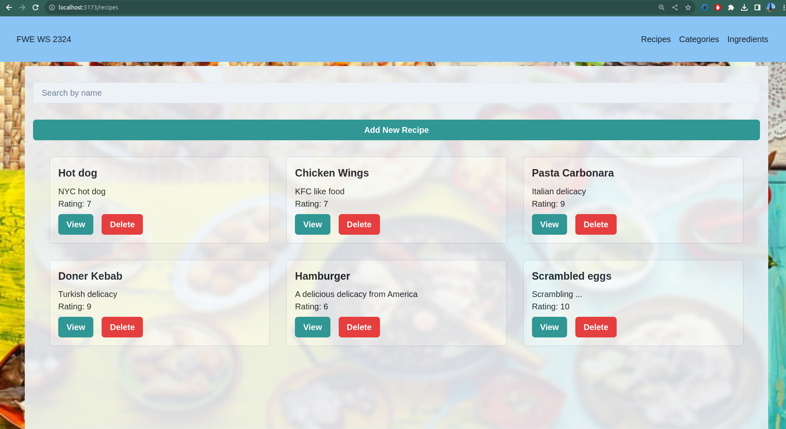

# Frontend

# All screenshots of the demonstrations are in the folder resources/demonstrations

---

This is the project of Dang Quang Tran 1113204

---
## Set up
Steps to set up the frontend.

1. Install all neccessary packages and dependencies via Package Manager npm in frontend.
```
cd /frontend
npm install
```
2. The Port for our website is determined upon running 
3. Use `npm run dev` or `yarn dev`  command line to run frontend.


## Base Layout
A Page is mainly seperated into two part
- The top of the Website is the Header which contains the name of the website and a navigation bar
- The rest of the Website is the Page which contains the content of the website.
- Every displayed entities are in a grid layout.

### Header
- The Header has a navigation bar which can leads to our pages through a list of horizontally placed button.
- Upon clicking the FWE WS2324 on the top left corner of the website you will be redirected to the HomePage.


---
## Pages

This is all the pages that this Recipe website has.
### HomePage
This page contains three button that can navigate you to CategoryPage, IngredientPage and RecipeTablePage.


---
### CategoryPage
This page display a table of all the categories. You can add new Category, edit an existed Category and delete an existed Category


---
### IngredientPage
This page display a table of all the ingredients. You can add new Ingredient, edit an existed Ingredient and delete an existed Ingredient


---
> **Important**
> It's unfortunate that PUT (Update) functionalities for all entities do not work as expected.
> Reason for that is that the PUT payload is not correctly parsed by the frontend, e.g the ingredient {name: "test", id: 1} is expected but got ingredient : 1 instead
> I have tried to find solutions for this problem but I could not find any. However when sending PUT request via Postman it works as expected.
### Functionalities
- 
---
### RecipePage
This page display the recipe that you have chosen.



#### Search Recipe By Name
- By giving in a name you can search whether there is a recipe with the name you gave in.

